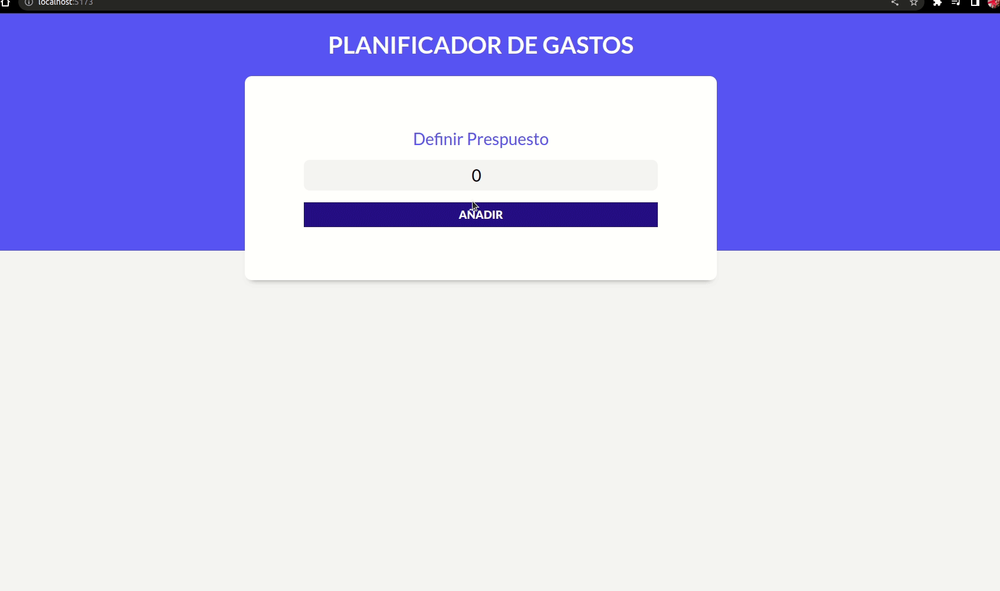

# App de control de gastos

App elaborada con la librería React, utilizando hooks propios de la mismas y algunas librería externas para mejorar la experiencia de usuario. No se utilizó ningún framework para dar estilos CSS en esta oportunidad.
La APP permite extablecer un presupuesto sobre el cual se irán efetuando y almacenando gastos, devolviendonos valores de importes total gastado, remanente y porcentages mediante un grafico circular. Los gastos pueden editarse y eliminarse impactando en los calculos antes descriptos. Los estados de la App son sustentables mediante el uso de localStorage.

[Acceso a App](https://control-gastos-eta.vercel.app/)

## Video Demo

## Ejecutando este Proyecto

1. Abre la terminal de Git
2. Cambia el directorio de trabajo actual a la ubicación en donde quieres clonar el directorio.
   `cd proyecto`

3. Escribe git clone seguido de la [URL](https://github.com/emanuelheredia/control-gastos) del proyecto

`git clone https://github.com/emanuelheredia/control-gastos `

4. Presiona Enter para crear tu clon local

    > $ git clone https://github.com/YOUR-USERNAME/YOUR-REPOSITORY
    > Cloning into `Spoon-Knife`...
    > remote: Counting objects: 10, done.
    > remote: Compressing objects: 100% (8/8), done.
    > remove: Total 10 (delta 1), reused 10 (delta 1)
    > Unpacking objects: 100% (10/10), done.

5. Instalar todas las dependencias necesarias dentro del directorio del proyecto
   `npm install`

6. Por último inicia el proyecto con npm start donde se iniciará el dashboard de expo en el navegador
   `npm start`

# Mis Redes :

-   [GITHUB](https://github.com/emanuelheredia)
-   [LINKEDIN](https://www.linkedin.com/in/emanuel-heredia-41749421a/)
